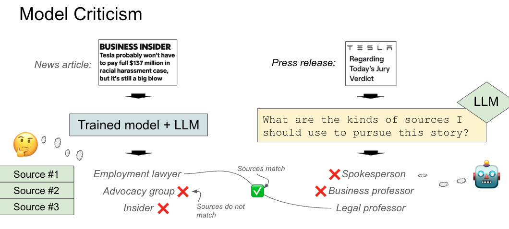
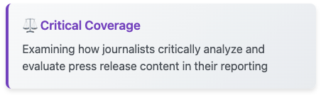
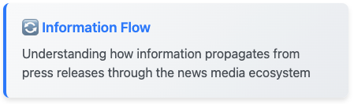
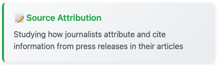
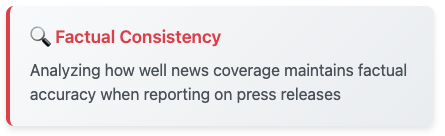

# Press Releases and News Articles Dataset

This repository contains the dataset and code accompanying our EMNLP 2024 paper: [Do LLMs Plan Like Human Writers? Comparing Journalist Coverage of Press Releases with LLMs](https://aclanthology.org/2024.emnlp-main.1216.pdf).

## Overview




Our paper introduces a framework for assessing how well Large Language Models (LLMs) are able to plan like humans, as shown above, and whether their planning matches human planning. We take as a task the task of planning the sources to talk to to confirm and criticize a press release. 

A major contribution of this work is collecting and releasing a large dataset that tracks how press releases are covered by news articles in the media. This dataset consists of pairs where press releases → news articles are hyperlinked. In addition to the use-cases explored in our paper, we believe this dataset can facilitate research in:

 

 

<div style="background: linear-gradient(135deg, #007bff 0%, #0056b3 100%); padding: 25px; margin: 25px 0; border-radius: 12px; box-shadow: 0 8px 16px rgba(0, 123, 255, 0.2); border: 3px solid #ffffff;">
  <p style="margin: 0; color: #ffffff; font-weight: 700; font-size: 1.2em; text-align: center; text-shadow: 1px 1px 2px rgba(0,0,0,0.2);">🌟 If you are interested in doing follow-up work that utilizes this dataset, please let us know!! We'd love to hear from you! 🌟</p>
</div>


## Dataset Structure

The dataset is organized into two main components, based on the two main collection methods.

### Forwards Direction (Press Releases → News Articles)

We collected press releases and articles by starting from press releases and using backlink services to discover news articles that reference them.

This is the more comprehensive and cleaner portion of the dataset, containing 587,464 news articles and 176,777 press releases. The data is stored in:
- `full-source-scored-data.jsonl.gz`: Contains article metadata and source annotations for all articles
- `all-coref-resolved`: A HuggingFace Dataset containing processed articles with coreference resolution

### Backwards Direction (Press Releases ← News Articles)

We collected data by starting from news articles and discovering hyperlinks to press releases. This portion contains 938,880 news articles and 75,528 press releases, stored in a SQLite database (`article_to_press_release_data.db`) containing:
- `article_data`: 938,880 news articles with metadata
- `press_release_data`: Press release content and metadata
- `article_to_href`: Mapping between articles and press release hyperlinks
- Additional metadata tables for entity recognition and article mapping

## Getting Started

1. Download the dataset from our [Google Drive folder](https://drive.google.com/drive/folders/1kZwvSR-t9gtdaObvGU-ot3OEua_Hsfc4?usp=sharing)


2. For the forwards direction data, download the following files from [this Google Drive link](https://drive.google.com/drive/folders/11IpwmFKuFn7LryUHW1df1fcJ2RmFUub1?usp=drive_link):
   - `full-source-scored-data.jsonl.gz`: Contains article metadata and source annotations
   - `all-coref-resolved`: A HuggingFace Dataset containing processed articles and text
   - `article-to-pr-mapper.csv.gz`: Maps articles to their corresponding press releases
   - Place these files in a folder: `data/press_release_to_article_data/`


3. For the backwards direction data, extract the database:
```bash
tar -xvzf data/article_to_press_release_data.db.tar.gz
```
This is a SQLite database contains with news articles, press releases, metadata and hyperlink relationships. The database includes tables for article content, press release content, entity recognition, and article-to-press-release mappings.


4. See `2024-05-28__demo.ipynb` for detailed examples of:
   - Loading and processing the dataset
   - Finding press release/article pairs
   - Extracting sources from news articles
   - Analyzing factual consistency

## Key Features

- **Source Annotations**: Each sentence in news articles is annotated with its information source
- **Coreference Resolution**: Articles are processed with coreference resolution for better analysis
- **Factual Consistency**: Tools for analyzing the factual consistency between press releases and news coverage
- **Source Extraction**: Methods for identifying and analyzing sources in news articles


## Citation

If you use this dataset in your research, please cite our paper:

```bibtex
@inproceedings{spangher2024llms,
  title={Do llms plan like human writers? comparing journalist coverage of press releases with llms},
  author={Spangher, Alexander and Peng, Nanyun and Gehrmann, Sebastian and Dredze, Mark},
  booktitle={Proceedings of the 2024 Conference on Empirical Methods in Natural Language Processing},
  pages={21814--21828},
  year={2024}
}
```

## Contact

spangher@usc.edu


## Follow up work using this dataset

Here is current and ongoing work:

### Source planning as a multi-document retrieval task

This work introduces a new benchmark for multi-document retrieval that focuses on how journalists select sources when writing news articles, using our press release dataset to evaluate how well retrieval models can identify and rank potential sources that journalists might want to interview or reference.

```bibtex
@inproceedings{spangher2025novel,
  title={A Novel Multi-Document Retrieval Benchmark: Journalist Source-Selection in Newswriting},
  author={Spangher, Alexander and Huang, Tenghao and Huang, Yiqin and Spangher, Lucas and Min, Sewon and Dredze, Mark},
  booktitle={Proceedings of the 4th International Workshop on Knowledge-Augmented Methods for Natural Language Processing},
  pages={180--204},
  year={2025}
}
```

### Sourcing for user comprehension of news articles:

A website for exploring the reporting process of news articles is available at [https://usc-research.appspot.com/explore_reporting/doc_source_data/5](https://usc-research.appspot.com/explore_reporting/doc_source_data/5). This interactive tool demonstrates how our dataset can be used to build systems that help readers understand the sources behind news articles and their roles in the reporting process.

